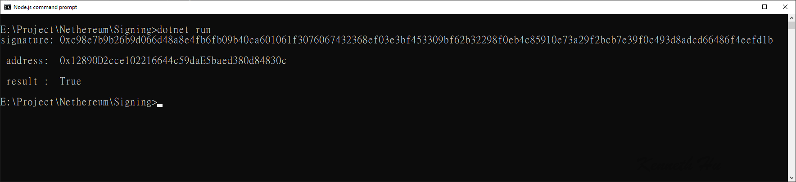

# NethereumMessageSigning
Using Nethereum for message signing


# Step :

## 1. donwload source code from this repository

## 2. restore package

```
    dotnet restore
```

## 3. execute dotnet command 

```
    dotnet run
```

## 4. result

